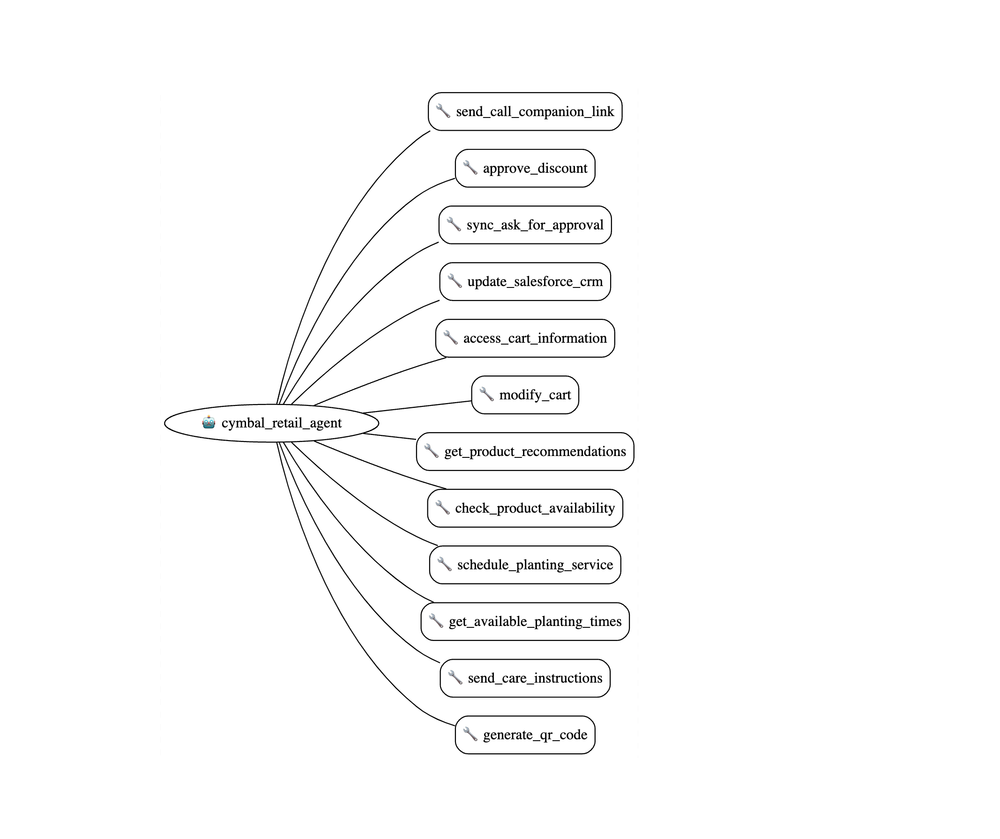

# MAA Appointment Booking Service

This project implements the MAA (Multi-modal AI Assistant) for Big Bank Bank appointment booking, built using Google's Agent Development Kit (ADK). The agent specializes in helping bank customers schedule, reschedule, and manage appointments efficiently while providing excellent customer service.

## Overview

The MAA Appointment Booking Service is designed to provide a seamless and professional banking experience for customers. It leverages Gemini to understand customer needs, manage appointments, provide branch information, and offer personalized banking service recommendations. The agent maintains professional banking standards while being efficient and customer-focused.

## Agent Details

The key features of the MAA Appointment Booking Agent include:

| Feature            | Description             |
| ------------------ | ----------------------- |
| _Interaction Type_ | Conversational          |
| _Complexity_       | Intermediate            |
| _Agent Type_       | Single Agent            |
| _Components_       | Tools, Multimodal       |
| _Vertical_         | Banking & Financial Services |

### Agent Architecture



The agent is built using a professional banking service architecture, combining appointment management, branch information systems, and customer service tools. It integrates with appointment scheduling systems, branch databases, and customer relationship management to provide a comprehensive banking service experience.

**Note**: This agent includes integration capabilities with the MAA backend system. The tools can be connected to actual banking systems by updating the API endpoints in [customer_service/tools/tools.py](./customer_service/tools/tools.py)

### Key Features

- **Appointment Management:**
  - Schedules new appointments for various banking services
  - Reschedules existing appointments based on availability
  - Cancels appointments when requested by customers
  - Retrieves customer appointment history
- **Branch Services Information:**
  - Provides detailed information about branch locations and services
  - Helps customers choose the most appropriate branch for their needs
  - Offers information about specialized services at different locations
- **Personalized Banking Assistance:**
  - Greets customers by name and acknowledges their banking relationship
  - Maintains professional banking communication standards
  - Provides tailored service recommendations based on customer profile
  - Checks available time slots and presents them to the customer.
  - Confirms appointment details and sends a confirmation/calendar invite.
- **Customer Support and Engagement:**
  - Sends via sms or email plant care instructions relevant to the customer's purchases and location.
  - Offers a discount QR code for future in-store purchases to loyal customers.
- **Tool-Based Interactions:**
- **Banking Services Integration:**
  - Supports all major banking services for appointment scheduling
  - Integrates with branch management systems
  - Provides real-time appointment availability
- **Customer Relationship Management:**
  - Maintains customer appointment history
  - Provides personalized service recommendations
  - Ensures professional banking communication standards
- **Flexible Scheduling:**
  - Multi-branch support with specialized services
  - Real-time availability checking
  - Automatic confirmation and notification systems

#### Agent State - Default customer information

The agent's session state is preloaded with sample bank customer data (Jack Rogers), simulating a real banking conversation. Ideally, this state should be loaded from the bank's CRM system at the start of the conversation, using the customer's information. This assumes that either the agent authenticates the customer or the customer is already logged in through the banking system. If this behavior needs to be modified, edit the [get_customer(current_customer_id: str) in customer.py](./customer_service/entities/customer.py)

#### Tools

The agent has access to the following banking tools:

- `get_available_appointment_times(date: str, location: str) -> dict`: Check available appointment slots for specific dates and branches.
- `schedule_appointment(reason: str, date: str, time: str, location: str, banker_id: str) -> dict`: Book new banking appointments.
- `reschedule_appointment(appointment_id: str, new_date: str, new_time: str, new_location: str) -> dict`: Modify existing appointments.
- `cancel_appointment(appointment_id: str) -> dict`: Cancel existing appointments.
- `get_customer_appointments(customer_id: str) -> dict`: Retrieve customer's appointment history.
- `get_branch_information(location: str) -> dict`: Get detailed branch information and services.
- `send_appointment_confirmation(appointment_details: dict, customer_email: str) -> dict`: Send confirmation emails to customers.

## Setup and Installations

### Prerequisites

- Python 3.11+
- Poetry (for dependency management)
- Google ADK SDK (installed via Poetry)
- Google Cloud Project (for Vertex AI Gemini integration)

### Installation
1.  **Prerequisites:**

    For the Agent Engine deployment steps, you will need
    a Google Cloud Project. Once you have created your project,
    [install the Google Cloud SDK](https://cloud.google.com/sdk/docs/install).
    Then run the following command to authenticate with your project:
    ```bash
    gcloud auth login
    ```
    You also need to enable certain APIs. Run the following command to enable
    the required APIs:
    ```bash
    gcloud services enable aiplatform.googleapis.com
    ```

1.  Clone the repository:

    ```bash
    git clone https://github.com/google/adk-samples.git
    cd adk-samples/python/agents/customer-service
    ```

    For the rest of this tutorial **ensure you remain in the `agents/customer-service` directory**.

2.  Install dependencies using Poetry:

- if you have not installed poetry before then run `pip install poetry` first. then you can create your virtual environment and install all dependencies using:

  ```bash
  poetry install
  ```

  To activate the virtual environment run:

  ```bash
  poetry env activate
  ```

3.  Set up Google Cloud credentials:

    - Ensure you have a Google Cloud project.
    - Make sure you have the Vertex AI API enabled in your project.
    - Set the `GOOGLE_GENAI_USE_VERTEXAI`, `GOOGLE_CLOUD_PROJECT`, and `GOOGLE_CLOUD_LOCATION` environment variables. You can set them in your `.env` file (modify and rename .env_sample file to .env) or directly in your shell. Alternatively you can edit [customer_service/config.py](./customer_service/config.py)

    ```bash
    export GOOGLE_CLOUD_PROJECT=YOUR_PROJECT_NAME_HERE
    export GOOGLE_GENAI_USE_VERTEXAI=1
    export GOOGLE_CLOUD_LOCATION=us-central1
    ```

## Running the Agent

You can run the agent using the ADK commant in your terminal.
from the root project directory:

1.  Run agent in CLI:

    ```bash
    adk run customer_service
    ```

2.  Run agent with ADK Web UI:
    ```bash
    adk web
    ```
    Select the customer_service from the dropdown

### Example Interaction

Here's a quick example of how a user might interact with the agent:

**User:**:
hi there

**Agent**:
Hey Alex, I see you've been a Cymbal Home & Garden customer for a couple of years now - we appreciate your business! I also see you have a few things in your cart already. How can I help you get your garden growing today?

**User**:
Yeah, so I'm a bit confused. I just bought some...uh...plants or flowers that I wanted to put in the backyard. They just say "sun loving annuals" on them. I totally spaced on picking up potting soil so I'm placing an order for pickup now. The problem is, I'm not sure if the potting soil and fertilizer I picked out are the right ones.

**Agent**:
I understand – it can be tricky when you're not quite sure what you've got! Let's figure this out together. Don't worry, we'll get your plants the right care. To best help you, would you be willing to share a quick video of the plants you've purchased? That will help me identify them and make sure you have the right supplies.

**User**:
Sure, how do I do that?

**Agent**:
I just texted you a link to the number in your profile. Just click on that, and it'll open a secure video connection.

```tool_code
print(send_call_companion_link(phone_number='+12065550123'))
```

```tool_outputs
{'status': 'success', 'message': 'Link sent to +12065550123'}
```

**User**:
Okay, I clicked the link...can you see this?

**Agent**:
Yes I can see you Alex! Can you go ahead and point the camera at your plants so I can inspect them?

**User**:
Yes of course!
...

## Evaluating the Agent

Evaluation tests assess the overall performance and capabilities of the agent in a holistic manner.

**Steps:**

1.  **Run Evaluation Tests:**

    ```bash
    pytest eval
    ```

    - This command executes all test files within the `eval` directory.

## Unit Tests

Unit tests focus on testing individual units or components of the code in isolation.

**Steps:**

1.  **Run Unit Tests:**

    ```bash
    pytest tests/unit
    ```

    - This command executes all test files within the `tests/unit` directory.

## Configuration

You can find further configuration parameters in [customer_service/config.py](./customer_service/config.py). This incudes parameters such as agent name, app name and llm model used by the agent.

## Deployment on Google Agent Engine

In order to inherit all dependencies of your agent you can build the wheel file of the agent and run the deployment.

1.  **Build Customer Service Agent WHL file**

    ```bash
    poetry build --format=wheel --output=deployment
    ```

1.  **Deploy the agent to agents engine**
    It is important to run deploy.py from within deployment folder so paths are correct

    ```bash
    cd deployment
    python deploy.py
    ```

### Testing deployment

This code snippet is an example of how to test the deployed agent.

```
import vertexai
from customer_service.config import Config
from vertexai.preview.reasoning_engines import AdkApp


configs = Config()

vertexai.init(
    project="<GOOGLE_CLOUD_LOCATION_PROJECT_ID>",
    location="<GOOGLE_CLOUD_LOCATION>"
)

# get the agent based on resource id
agent_engine = vertexai.agent_engines.get('DEPLOYMENT_RESOURCE_NAME') # looks like this projects/PROJECT_ID/locations/LOCATION/reasoningEngines/REASONING_ENGINE_ID

for event in remote_agent.stream_query(
    user_id=USER_ID,
    session_id=session["id"],
    message="Hello!",
):
    print(event)

```

## Disclaimer

This agent sample is provided for illustrative purposes only and is not intended for production use. It serves as a basic example of an agent and a foundational starting point for individuals or teams to develop their own agents.

This sample has not been rigorously tested, may contain bugs or limitations, and does not include features or optimizations typically required for a production environment (e.g., robust error handling, security measures, scalability, performance considerations, comprehensive logging, or advanced configuration options).

Users are solely responsible for any further development, testing, security hardening, and deployment of agents based on this sample. We recommend thorough review, testing, and the implementation of appropriate safeguards before using any derived agent in a live or critical system.